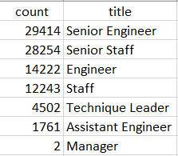
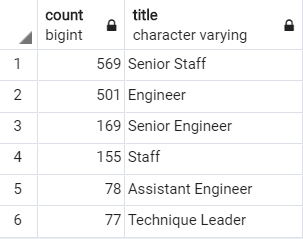

# Pewlett-Hackard-Analysis

## Overview of the analysis

The purpose of this analysis is to answer two questions regarding the employees of Pewlett Hackard: who is retiring and how many they are? In order to help the company to plan ahead how to deal with these retirements and find solutions.

## Results

About the results of the analysis we can say the following:
-	90.398 people in total are close to retirement within the company.
-	Here is a table with the people retiring group by their titles:

 
 
 
Where we can see that the majority of them are Senior Engineers, followed by Senior Staffs.
-	The managers group have 2 people retiring shortly. 
-	From the total number, 1549 are eligible for the mentoring program.

## Summary

o	How many roles will need to be filled as the "silver tsunami" begins to make an impact?

When the silver tsunami starts to make an impact, the roles to be affected are 7: Senior Engineers, Senior Staffs, Engineers, Staffs, Technique Leaders, Assistant Engineers and Managers.

o	Are there enough qualified, retirement-ready employees in the departments to mentor the next generation of Pewlett Hackard employees?

In my opinion there’s not enough mentors for the next generation, to support this I created an additional table classifying all the qualify employees for the mentorship into the job titles, where you can see that for example of 29.414 Senior Engineers retiring there’s only 169 with the same position within the company that can work as mentors.

